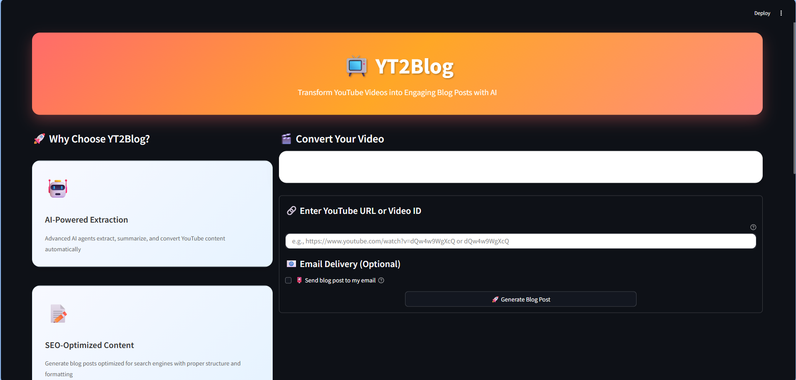
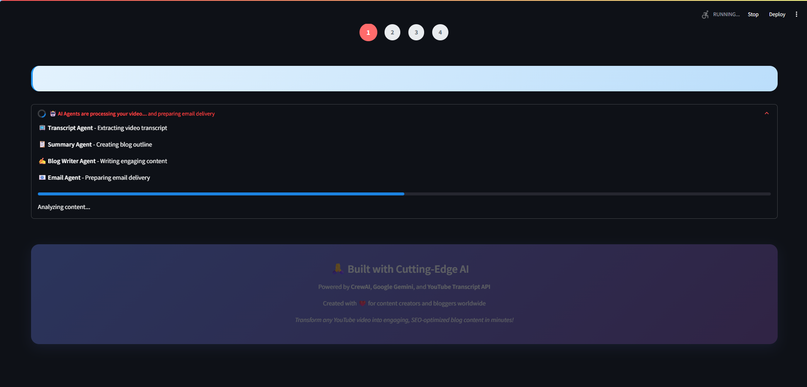
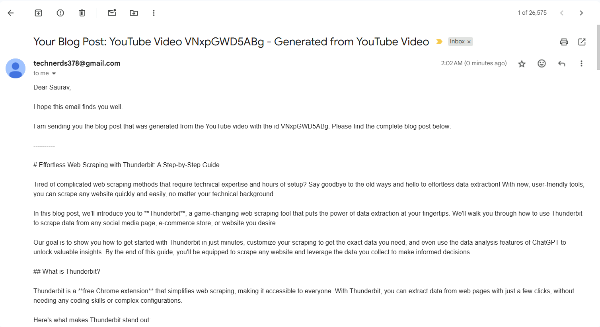
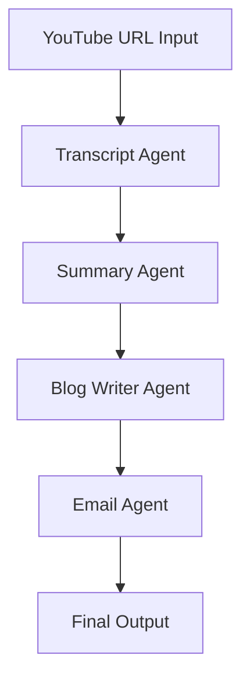

# 🎬 YT2Blog - AI-Powered YouTube to Blog Converter

<div align="center">


[](https://python.org)
[](https://streamlit.io)
[](https://crewai.com)
[](https://ai.google.dev)

**Transform any YouTube video into engaging, SEO-optimized blog posts in minutes using advanced AI agents**

</div>


## 📸 Application Screenshots

<div align="center">

### 🎨 Main Interface

*Modern, responsive interface with gradient design and intuitive controls*

### ⚡ Processing Dashboard

*Real-time progress tracking with step indicators and status updates*

### 📧 Email Configuration

*Professional email delivery configuration with validation*

</div>

---

## 🌟 Overview

YT2Blog is a cutting-edge AI-powered application that revolutionizes content creation by automatically converting YouTube videos into comprehensive, SEO-friendly blog posts. Built with a sophisticated multi-agent architecture using CrewAI, it leverages the power of Google Gemini 2.0 Flash and advanced natural language processing to deliver professional-grade content.

### ✨ Key Highlights

- 🤖 **Multi-Agent AI System** - Specialized AI agents working in coordination
- ⚡ **Lightning Fast Processing** - Convert hours of video content in minutes
- 📧 **Automated Email Delivery** - Professional email distribution system
- 🎨 **Modern UI/UX** - Beautiful, responsive Streamlit interface
- 🔧 **Production Ready** - Robust error handling and logging
- 📱 **Cross-Platform** - Works on desktop, tablet, and mobile

---

## 🚀 Features

### 🎯 Core Functionality
- **Intelligent Transcript Extraction** - Automatically fetches and processes YouTube video transcripts
- **AI-Powered Summarization** - Creates structured outlines from video content
- **SEO-Optimized Blog Generation** - Produces engaging, search-engine friendly articles
- **Professional Email Distribution** - Automated delivery with customizable templates
- **Multi-Format Export** - Download as Markdown, TXT, or receive via email

### 🛡️ Advanced Capabilities
- **Robust URL Parsing** - Supports multiple YouTube URL formats
- **Real-time Progress Tracking** - Visual progress indicators and status updates
- **Error Recovery System** - Graceful handling of failures with detailed logging
- **Responsive Design** - Modern CSS with glassmorphism and micro-animations
- **Email Validation** - Professional-grade email format validation

---

## 🛠️ Tech Stack

<div align="center">

| Category | Technologies |
|----------|-------------|
| **AI/ML Framework** |   |
| **Backend** |   |
| **Frontend** |    |
| **APIs & Services** |   |
| **Development** |   |

</div>

---

## 🏗️ Architecture

### Multi-Agent System Design



### 🤖 Specialized AI Agents

1. **Transcript Extraction Specialist**
   - Fetches clean, accurate transcripts from YouTube videos
   - Handles multiple URL formats and video ID extraction
   - Error handling for unavailable or restricted content

2. **Blog Outline Strategist**
   - Analyzes transcript content for key themes
   - Creates structured outlines with hierarchical headings
   - Optimizes content flow for reader engagement

3. **AI Blog Writer**
   - Converts outlines into full-length articles
   - Maintains conversational tone and readability
   - Implements SEO best practices and formatting

4. **Email Delivery Specialist**
   - Professional email composition and formatting
   - SMTP integration with Gmail
   - Attachment support and delivery confirmation

---

## ⚡ Quick Start

### Prerequisites

- Python 3.8+
- Gmail account (for email functionality)
- Google API credentials (for Gemini)

### Installation

```bash
# Clone the repository
git clone https://github.com/saurav-sabu/YT2Write.git
cd YT2Write

# Create virtual environment
python -m venv venv
source venv/bin/activate  # On Windows: venv\Scripts\activate

# Install dependencies
pip install -r requirements.txt

# Set up environment variables
cp .env.example .env
# Edit .env with your credentials
```

### Environment Configuration

Create a `.env` file with the following variables:

```env
# Email Configuration
EMAIL_ADDRESS=your-email@gmail.com
EMAIL_PASSWORD=your-app-password

# Google Gemini API
GEMINI_API_KEY=your-gemini-api-key
```

### Running the Application

```bash
streamlit run app1.py
```

Navigate to `http://localhost:8501` to access the application.

---

## 📱 Usage

### Step-by-Step Guide

1. **Enter Video URL**: Paste any YouTube URL or video ID
2. **Configure Email** (Optional): Enable email delivery and enter recipient
3. **Generate Content**: Click "Generate Blog Post" to start AI processing
4. **Download/Receive**: Save the blog post or receive it via email

### Supported URL Formats

```
✅ https://www.youtube.com/watch?v=VIDEO_ID
✅ https://youtu.be/VIDEO_ID
✅ https://www.youtube.com/embed/VIDEO_ID
✅ Direct Video ID: VIDEO_ID
```
---

## 🎨 UI/UX Features

### Modern Design Elements
- **Glassmorphism Effects** - Contemporary visual aesthetics
- **Gradient Backgrounds** - Eye-catching color schemes
- **Micro-animations** - Smooth hover effects and transitions
- **Responsive Layout** - Optimized for all device sizes
- **Progress Indicators** - Real-time processing feedback

### User Experience
- **Intuitive Interface** - Clean, user-friendly design
- **Visual Feedback** - Step indicators and status updates
- **Error Handling** - Graceful error messages and recovery
- **Accessibility** - Proper contrast and semantic markup
---

## 📁 Project Structure

```
yt2write/
├── 📁 .streamlit/           # Streamlit configuration
├── 📁 __pycache__/          # Python cache files
├── 📁 tools/                # Custom AI tools
│   ├── 📁 __pycache__/      # Tool cache files
│   ├── 🐍 email_tool.py    # Email delivery tool
│   └── 🐍 youtube_transcript_extraction.py  # YouTube transcript tool
├── 📁 yt_write/             # Main application directory
├── ⚙️ .env                  # Environment variables
├── 🚫 .gitignore           # Git ignore rules
├── 🚀 app.py               # Main Streamlit application
├── 🚀 app1.py              # Alternative app version
├── 📄 LICENSE              # MIT License
├── 📖 README.md            # Project documentation
├── 📦 requirements.txt     # Python dependencies
├── 🤖 yt2write_agents.py   # AI agents definition
└── 📋 yt2write_tasks.py    # Task orchestration
```

---

---

## 🚀 Deployment

### Local Development
```bash
streamlit run app1.py
```

### Production Deployment
- **Streamlit Cloud** - One-click deployment

---

## 🔮 Future Enhancements

### Planned Features
- [ ] **Multi-language Support** - International content processing
- [ ] **Batch Processing** - Multiple videos simultaneously
- [ ] **Custom Templates** - Personalized blog formatting
- [ ] **Social Media Integration** - Direct publishing to platforms
- [ ] **Analytics Dashboard** - Performance tracking and insights
- [ ] **API Endpoints** - Programmatic access to functionality

### Technical Improvements
- [ ] **Database Integration** - Content history and management
- [ ] **Caching System** - Improved performance and response times
- [ ] **Advanced AI Models** - Integration with latest language models
- [ ] **Real-time Collaboration** - Multi-user editing capabilities

---

## 🤝 Contributing

We welcome contributions from the community! Here's how you can help:

### Development Setup
```bash
# Fork the repository
git clone https://github.com/saurav-sabu/YT2Write.git

# Create a feature branch
git checkout -b feature/amazing-feature

# Make your changes and commit
git commit -m "Add amazing feature"

# Push to your fork and create a Pull Request
git push origin feature/amazing-feature
```

### Contribution Guidelines
- Follow PEP 8 style guidelines
- Add comprehensive tests for new features
- Update documentation for any changes
- Ensure backward compatibility

---

## 📄 License

This project is licensed under the MIT License - see the [LICENSE](LICENSE) file for details.

---

## 🙏 Acknowledgments

- **CrewAI** - Multi-agent AI framework
- **Google Gemini** - Advanced language model
- **Streamlit** - Rapid web app development
- **YouTube Transcript API** - Video transcript extraction
- **Open Source Community** - Various dependencies and tools

---

## 📞 Contact

<div align="center">

[](https://www.linkedin.com/in/sauravsabu789/)
[](https://github.com/saurav-sabu)
[](mailto:saurav.sabu9@gmail.com)

**Built with ❤️ for content creators and developers worldwide**

</div>

---

<div align="center">

### ⭐ Star this repository if you found it helpful!


</div>